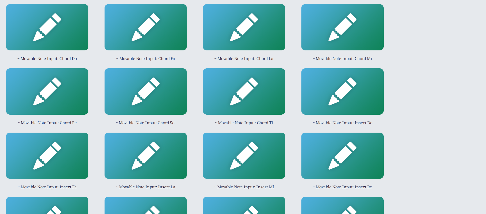
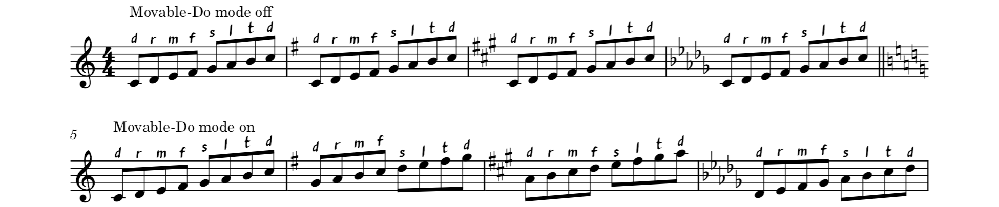

# Movable Note Input

> The same plugin set works on both MuseScore 3 and 4.

This is a set of plugins that implements [the Movable-Do note input mode for computer keyboard](https://github.com/musescore/MuseScore/issues/21880). It mainly exists as a proof-of-concept.

If you prefer Movable-Do Solfa note names (Do, Re, Mi...) over Fixed-Do standard letter note names (A, B, #C...) when expressing your musical ideas, you may find this helpful.

## Important Notice

Since one MuseScore plugin can only contain one action, this is not a _single_ plugin. This is **a set of 23 plugins** (insertion, adding-to-chord and replacement for each note name, plus two special actions that turn on and off Movable-Do mode). It WILL flood your plugin management screen.

To reduce clutter, a `~` character is prepended to the name of each plugin, making sure they will be ranked last.

## Installation

1. Download the code and unzip it under the user's `Plugins` directory (check MuseScore preferences if you don't know where).
2. Restart MuseScore, and enable ALL the plugins. To quickly enable a plugin, click on it and hit Spacebar.  
   
3. Open the keyboard shortcuts settings. Take a backup of your current settings in case you mess them up.
4. Clear ALL note input keyboard shortcuts (including `Enter note X`, `Add note X to chord` and `Insert X`).
5. Search `Movable Note Input`, and assign appropriate keyboard shortcuts to the actions.  
   Instead of `A`~`G`, it is more recommended to use `D` `R` `M` `F` `S` `L` `T` (the letters in Solfa note names), but in this way you have to change conflicting keybinds.

## Usage

Open a score to use the plugins.

Movable-Do input mode is disabled by default. Press the `Movable Note Input: Turn On` key to enable it. Then enter notes from computer keyboard as usual.

The Movable-Do input mode enable flag is stored on a per-score basis, in the score metadata `__movable_note_input_toggle`.

When typing in drum staves, Movable-Do mode will be auto-disabled. You must always use the shortcut you assigned for note `A` to type an `A` in the notation.

## Known Issues

### MuseScore 3: Text Input Blocked

If an ordinary key used in text input is assigned to one of the plugins, it will invoke the plugin instead of typing the character even if the cursor is inside a text box. This does not seem possible to avoid using plugin API.

There is a temporary workaround which may only work well when typing chord symbols.

### Chromatic Alterations

When typing across chromatic alterations in note input mode, the plugin may not instantly realize the key signature change. To workaround, exit note input mode and re-enter it when crossing chromatic alterations.

### Plugin Manager Clutter

This is not quite possible to avoid since one plugin can only have one keyboard shortcut.

It is possible to bundle the 23 actions into one extension (the built-in Courtesy Accidentals plugins works this way), but MuseScore provides no folder for user-installed extensions. It is likely that this feature is experimental, so we'd better avoid it for now.

### Log Spam

When using the plugin, each note input command you trigger will leave behind two log lines. The log size may grow faster than expected.
